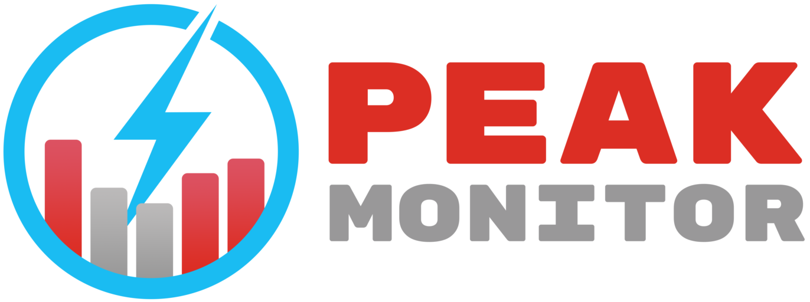

# Peak Monitor for Home Assistant

A Home Assistant custom integration for monitoring power tariffs with peak consumption tracking. Primarly designed for Swedish power tariff systems (effekttariff), but can be adapted for use in other countries if their electricity pricing model includes peak-based tariffs or if only some of the functionality is of interest. Note that some features (such as Swedish holiday detection) will not work perfectly for non-Swedish users, but can instead be configured with external sensors.

## Om integrationen (Svenska)

Peak Monitor är en integration för Home Assistant som hjälper dig övervaka och optimera din elförbrukning enligt svenska effekttariffer. Integrationen spårar dina högsta förbrukningstopp per timme och beräknar den genomsnittliga effektavgiften baserat på dessa. Med realtidsövervakning kan du se hur nära du är att öka din månadskostnad och få en målnivå att hålla dig under. Integrationen stödjer reducerade tariffperioder (t.ex. nattetid), svenska helgdagar, och flexibel konfiguration för olika elnätsbolags effekttariff-modeller. Perfekt för dig som vill ha full kontroll över din effektavgift och undvika onödigt höga elräkningar.

## 📖 Documentation

- **[Installation Guide](docs/INSTALL.md)** - Comprehensive step-by-step installation instructions
- **[Configuration Guide](docs/CONFIGURATION.md)** - Detailed explanation of every configuration option
- **[Configuration Examples](docs/CONFIGURATION_EXAMPLES.md)** - Ready-made settings for common Swedish DSOs
- **[Sensor Reference](docs/REFERENCE.md)** - Complete guide to all sensors and their usage
- **[Real-World Examples](docs/REAL_WORLD_EXAMPLES.md)** - Annotated screenshots showing sensor behaviour in real scenarios

## Key Features

- 📊 Track hourly consumption peaks in real-time
- 🎯 Get a target consumption level that won't increase your monthly cost
- 💰 Calculate estimated monthly tariff cost in real currency
- 💸 See real-time cost impact of an ongoing high-consumption event
- ⚡ Smart interval estimation — internal or external sensor
- 🏠 Supports a variety of tariff models - more are being development
- 🌙 Reduced tariff support for night hours and weekends
- 🎄 Swedish public holiday detection
- 🔧 Fully UI-configurable — no YAML required
- 🔕 External mute sensor support
- 🤖 Automation-ready — rich sensor set covers everything needed to shed load, pause chargers, or send alerts before a peak locks in

## ⚠️ Limitations

Peak Monitor is designed specifically for tracking **power tariff size and estimated tariff costs** — the capacity-based component of your electricity bill (effektavgift / kapacitetsavgift). It is **not** a general-purpose energy cost monitor.

In particular, Peak Monitor does **not** track or calculate:
- The actual cost of the electricity you consume (rörlig elhandelsavgift / spotpris)
- Transfer fees (nätavgift) beyond the configurable fixed monthly fee
- Taxes (energiskatt, moms)
- Any other variable components of your electricity bill

If you need a complete picture of your total electricity costs, there are better-suited tools for that purpose — for example integrations that read your hourly spot price or connect directly to your energy supplier's data. Peak Monitor is intentionally focused on the single task it does well: keeping your capacity peaks low.

## Quick Installation

### Via HACS (Recommended)

1. Open HACS → Integrations
2. Add custom repository: `https://github.com/krogell/peak-monitor`
3. Search for "Peak Monitor"
4. Click Install
5. Restart Home Assistant
6. Add integration: Settings → Devices & Services → Add Integration

### Manual Installation

1. Download the latest release
2. Extract to `/config/custom_components/peak_monitor/`
3. Restart Home Assistant
4. Add integration: Settings → Devices & Services → Add Integration

For detailed installation instructions, see [INSTALL.md](docs/INSTALL.md).

## Configuration

After installation:
1. Go to Settings → Devices & Services → Add Integration
2. Search for "Peak Monitor"
3. Configure your settings (see [Configuration Guide](docs/CONFIGURATION.md) for detailed explanations)

To edit configuration later:
1. Go to Settings → Devices & Services
2. Find Peak Monitor
3. Click "Configure"
4. Make changes and save

## Understanding Your Sensors

The integration creates several sensors to help you monitor and optimize your power consumption:

- **Period Average** — Your current tariff level (average of your top N monthly peaks)
- **Target** — Stay below this to avoid increasing your monthly fee
- **Target Headroom** — How much room remains below target (positive = safe, negative = over target)
- **Status** — Whether tariff is active, reduced, or inactive
- **Period Cost** — Estimated monthly capacity fee in your currency *(when price is configured)*
- **Estimated cost increase** — What extra cost will be, if current consumption continues *(when price is configured)*
- And more...

See the [Sensor Reference](docs/REFERENCE.md) for complete details on all sensors, their visibility, and attributes.

## License

MIT License - see [LICENSE](LICENSE) for details.

## Author

Tommy Krogell (@krogell)
