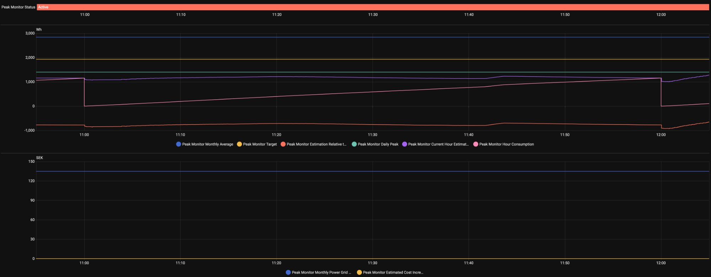
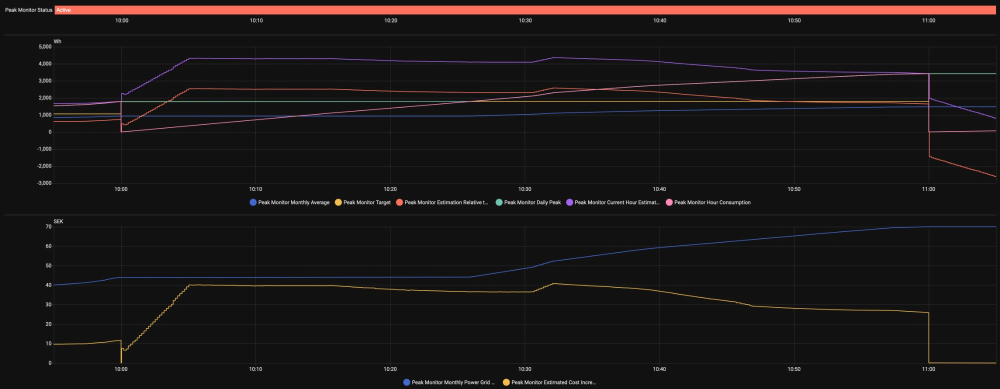
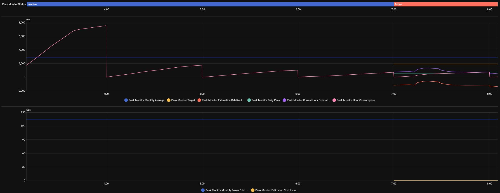
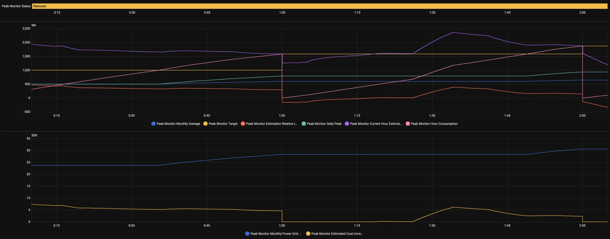
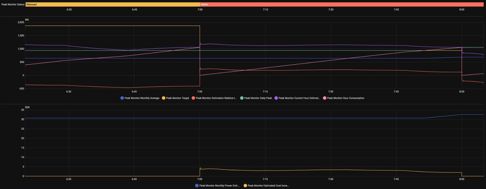

# Real-World Examples

This page shows actual Peak Monitor sensor graphs captured from a live Home Assistant installation. Each example illustrates a specific scenario and explains what the sensors are doing — and why. Please note that currently some examples are from development phase and may be slightly different or inaccurate.

> **Chart legend**
> | Colour | Sensor |
> |---|---|
> 🔵 Blue | Monthly Average |
> 🟡 Yellow | Target |
> 🟠 Orange | Estimation Relative to Target |
> 🟢 Green | Daily Peak |
> 🟣 Purple | Interval Consumption Estimate |
> 🩷 Pink | Interval Consumption |
>
> The top status bar shows the current tariff state: **Inactive** (blue), **Reduced** (amber), or **Active** (red/salmon).

---

## Example 1 — Normal operation, interval consumption sensor reset

This example shows a quiet daytime hour where consumption stays comfortably below the target. The sensor that feeds Peak Monitor resets to zero at the top of each hour.

**What to look for:**

- **11:00 — Consumption sensor resets to zero.** The pink Interval Consumption line drops abruptly to zero at the hour boundary. This is expected behaviour for a meter that resets every hour — Peak Monitor handles this automatically and begins accumulating the new hour's consumption from scratch.

- **11:00–11:59 — All sensors well below target.** The current-hour estimation (purple) and daily peak (green) both sit below the yellow target line throughout the entire hour. The orange Estimation Relative to Target line is negative, meaning current consumption is tracking below the level that would increase costs. No action needed.

- **12:00 — Estimation and interval consumption converge.** As the hour approaches its end, the estimation sensor (purple) and the actual interval consumption (pink) converge toward the same value. This is correct: by the final minutes of an hour, the estimation has very little remaining time to model and approaches the real measured value.

**Takeaway:** This is what a well-controlled, normal hour looks like. All sensors below target, cost increase sensor at zero, no intervention required.

---

## Example 2 — Normal operation, daily peak tracking

This example shows what happens when consumption rises above the previous daily peak mid-hour, while still remaining below the monthly target.

**What to look for:**

- **12:00 — Hour starts normally.** Consumption sensor resets and begins accumulating. Estimation (purple), interval consumption (pink), and daily peak (green) all start their normal tracking. Consumption is below the target (yellow) — no concern.

- **12:08 — Estimation sensor surpasses the daily peak.** The purple estimation line crosses above the green daily peak line. This means Peak Monitor is projecting that this hour will end higher than any previous hour today. The daily peak will be updated once the actual interval consumption confirms this at 13:00. This is fine — consumption is still well below the target.

- **12:54 — Daily peak starts following the interval consumption sensor.** As the end of the hour approaches, the actual measured consumption overtakes the daily peak threshold. The green daily peak line begins to rise and track alongside the pink interval consumption. This is correct behaviour: the daily peak updates in real time as soon as it becomes certain that this hour will set a new daily record.

**Takeaway:** The daily peak rising mid-hour is not a problem as long as it stays below the target. The target line (yellow) is what matters — that is the threshold above which monthly costs increase.

---

## Example 3 — Inactive period at morning start

This example shows how Peak Monitor handles high consumption during an inactive tariff period, and what happens when the tariff becomes active.

**What to look for:**

- **04:00 — High consumption, but tariff is inactive.** The pink Interval Consumption line climbs steeply, reaching around 7,000 Wh — a reading that would normally trigger a significant monthly cost increase. However, the status bar shows **Inactive** (blue), and the graph area is empty of target, daily peak, and cost sensors. Because the tariff is not active at this hour, this consumption is completely ignored by Peak Monitor. No peak is recorded, no cost is incurred.

- **~04:20 — Consumption plateaus and then declines.** The interval consumption levels off and begins to drop as whatever large load was running (e.g. a heat pump or EV charger) reduces power. The relative-to-target sensor (orange) shows a brief dip below zero corresponding to this but remains unavailable while inactive.

- **~06:00 — Consumption drops sharply again at the next hour boundary.** Another sensor reset visible at the 5:00 boundary. Overnight load patterns continue through the inactive window.

- **07:00 — Tariff becomes active.** The status bar transitions from Inactive (blue) to Active (salmon/red). At this point, Peak Monitor begins publishing the full set of sensors: the target (yellow), daily peak (green), relative-to-target (orange), and cost increase estimate. All sensors emerge at low, sensible values because the overnight high consumption was correctly excluded.

**Takeaway:** The inactive window protects against overnight or early-morning consumption spikes from distorting the monthly tariff calculation. Only consumption during the active window contributes to peaks.

---

## Example 4 — Monthly peak increase in progress

This example shows a situation where the current hour's consumption is on track to exceed the previous daily peak, pushing monthly costs upward.

**What to look for:**

- **10:00 — Daily peak equals target.** The green daily peak line and the yellow target are at the same level at the start of this window. This indicates that an earlier hour today has already set a daily peak that moved the monthly average — the target has been revised upward to reflect this. The situation starts the hour already "at the limit."

- **10:00+ — Estimation sensor exceeds target.** The purple current-hour estimation line climbs above the yellow target almost immediately after the hour starts. This means Peak Monitor is projecting that if consumption continues at this rate, the hour will end above the target, increasing monthly costs further. The orange Estimation Relative to Target sensor goes strongly positive — this is the signal that would typically trigger an automation or alert to shed load. The Cost Increase Estimate sensor (lower chart, yellow) also shows a positive value, indicating the projected additional monthly cost if the current rate continues.

- **~10:26 — New daily peak takes shape; monthly cost starts rising in real time.** As the hour progresses, the measured consumption passes the current daily peak and begins setting a new one. The green daily peak line rises. Monthly average (blue) also begins to move upward, but more slowly — because the monthly average is calculated over several peaks (e.g. 3 in this example), a single elevated hour only moves the average by one-third of the increase. The monthly power grid fee (lower chart, blue) also starts increasing in real time as the monthly average grows. The target remains fixed for the remainder of this hour; it will only be recalculated when the hour commits at :00.

- **11:00 — Hour sensor resets and the new peak is committed.** The pink interval consumption line drops to zero. The just-completed hour is now committed as the new daily peak (and the new highest monthly peak). The target is recalculated based on the updated monthly average — the yellow target line steps upward to reflect the new, higher cost baseline.

**Takeaway:** When the estimation sensor exceeds the target, action is needed *now* to reduce load before the hour ends. Once the hour commits at :00 it's too late — the peak is locked in. The Cost Increase Estimate sensor (lower chart) shows exactly how much this is costing if no action is taken.

---

*More examples will be added as they are collected. If you have an interesting scenario captured in your Home Assistant history, feel free to contribute it.*

---

## Reduced tariff — peak recorded at half weight

This example shows two hours of operation entirely within the **Reduced** tariff window (shown in amber at the top). The integration was freshly reset at the start of the month, so all three running peaks are at the 500 Wh baseline. The first ~10 minutes are cut off in this view because a residual high estimation from the previous hour was still decaying.

**~00:10 — All peaks at baseline, target doubled by reduction factor**
All three running peaks are at 500 Wh. The daily peak (green) is also at 500 Wh. Because the tariff is in Reduced mode with a factor of 0.5, the displayed target (yellow) is `500 / 0.5 = 1000 Wh` — this is the actual consumption ceiling the user can reach before the recorded peak exceeds 500 Wh. The estimation sensor (purple) is already well above target, and estimation relative to target (orange) is positive. The cost increase estimate (bottom panel, yellow) is non-zero, projecting extra cost if this consumption rate holds for the full hour.

**~00:18 — Interval consumption surpasses daily peak**
The interval consumption sensor (pink) climbs past the daily peak (green). This is still fine — because the reduction factor is active, the value that will actually be *recorded* as a peak is `interval consumption × 0.5`, which remains below the 500 Wh threshold at this point.

**~00:35 — Interval consumption surpasses the displayed target**
The accumulated interval consumption crosses the 1000 Wh target line. From this point onward, the daily peak updates in real time tracking `interval consumption × 0.5`. The monthly average (blue) also begins moving, but slowly — the new peak must average against the two remaining 500 Wh peaks, so the monthly average rises to only one-third of the new value above the 500 Wh floor. The monthly power grid fee (bottom panel, blue) updates correspondingly in real time.

**01:00 — New daily peak locked in; next hour starts**
At the hour boundary the interval consumption resets to zero. The daily peak is now fixed at the value committed from the 00:xx hour. For the new 01:xx hour, the target is `daily peak / 0.5` — doubled again because reduced mode is still active.

**~01:25 — Sudden step increase in consumption**
A large load turns on, causing the interval consumption sensor to jump sharply. The estimation sensor responds quickly and projects a high end-of-hour value. Relative to target turns strongly positive and the cost increase estimate spikes.

**~01:50 — Consumption once again above target**
The interval consumption crosses the target threshold again. Daily peak begins rising in real time. The monthly average and power grid fee follow, updating live as the peak grows.

---

## Transition from Reduced to Active — target shift mid-morning

This example captures the transition from **Reduced** (amber) to **Active** (salmon) mode, which in this configuration happens at 07:00. It illustrates how the removal of the reduction factor immediately changes the effective target and cost exposure — even without any change in actual consumption.

**06:30–06:59 — Final reduced-mode hour**
The tariff is Reduced. The target (yellow) is displayed at `daily peak / 0.5` — roughly double the actual peak threshold. The interval consumption (pink) is rising steadily but remains well below the displayed target. Estimation relative to target (orange) is negative throughout this period, meaning no cost increase is projected. The cost increase estimate sensor (bottom panel) stays flat near zero.

**07:00 — Transition to Active; reduction factor removed**
At the hour boundary two things happen simultaneously: the interval consumption resets to zero, and the tariff state switches from Reduced to Active. Without the `/ 0.5` scaling, the displayed target drops to equal the actual daily peak — the yellow and green lines converge. Even though the raw consumption level has not changed, the user now has significantly less headroom. The estimation sensor (purple) is already projecting a value slightly above the new lower target, so the cost increase estimate sensor immediately becomes non-zero.

**~07:50 — Interval consumption surpasses target**
The accumulated interval consumption crosses the target. The daily peak (green) begins updating in real time, rising in lockstep with interval consumption. Target (yellow) stays fixed for the remainder of the hour — it will only recalculate at 08:00. Relative to target climbs further positive, and the projected cost increase grows.

**08:00 — New peak committed; daily peak becomes the new target**
The hour resets. The peak from the 07:xx hour is committed: the daily peak now equals exactly the interval consumption from that hour. Because this is the largest peak of the day so far, the daily peak and the target once again land on the same value — the green and yellow lines sit on top of each other at the start of the new hour, just as they did at 07:00.
