# Real-World Examples

These graphs are captured from a live Home Assistant installation running Peak Monitor 2026.3.1. Each example shows what the sensors actually look like during a real scenario, with an explanation of what is happening and suggestions for how to act on the data automatically.

Please note that these examples have the older naming scheme.

---

## Example 1 — A quiet hour, then a load event

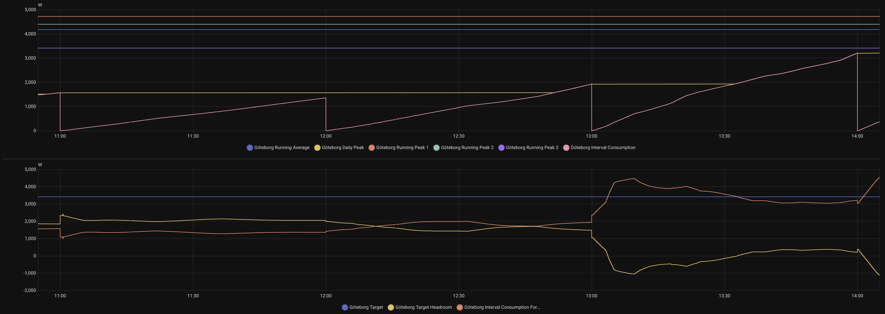

This graph covers three hours (11:00–14:00) and shows two different situations back to back: a quiet hour where everything is comfortably under control, followed by an hour where a load turns on and pushes the forecast above target.

**Top panel** shows the peak tracking sensors. The three flat lines near the top are the existing period peaks for the month (the three highest hours recorded so far). The blue Period Average sits just below them — this is the value that determines the monthly tariff. The daily peak (yellow) is low and flat during the quiet 11:xx hour, then rises at 13:00 as a new load appears. The pink Interval Consumption resets to zero at each hour boundary and climbs as energy accumulates.

**Bottom panel** shows the real-time decision sensors. Target (blue) stays flat — it only updates at interval boundaries. Target Headroom (yellow) is what to watch: during the quiet 11:xx hour it stays positive, meaning the forecast is safely below target. At 13:00 a load turns on, the Interval Consumption Forecast (orange) spikes sharply, and Target Headroom immediately crosses below zero — meaning the integration is now projecting a new peak if nothing changes. The load then reduces, the forecast falls, and headroom recovers back above zero well before the hour ends. No new peak is committed.

**What this looks like in practice:** The quiet hour needs no intervention. The load event at 13:00 would trigger any automation watching for Target Headroom going negative, but since the load backed off naturally, no action was needed this time.

### Automation suggestion

Trigger on Target Headroom going negative to pause controllable loads, then re-enable them when headroom is safely positive again:

```yaml
automation:
  - alias: "Pause EV charging when forecast exceeds target"
    trigger:
      - platform: numeric_state
        entity_id: sensor.peak_monitor_target_headroom
        below: 0
    condition:
      - condition: state
        entity_id: sensor.peak_monitor_status
        state: "active"
    action:
      - service: switch.turn_off
        target:
          entity_id: switch.ev_charger

  - alias: "Resume EV charging when headroom recovers"
    trigger:
      - platform: numeric_state
        entity_id: sensor.peak_monitor_target_headroom
        above: 2000   # positive buffer before re-enabling
    condition:
      - condition: state
        entity_id: sensor.peak_monitor_status
        state: "active"
    action:
      - service: switch.turn_on
        target:
          entity_id: switch.ev_charger
```

---

## Example 2 — A large load commits a new monthly peak

The next two graphs show the same one-hour window (13:00–14:00) from two different perspectives. A large load — an EV charger — turns on at 13:00 and runs for almost 20 minutes, pushing the interval consumption well above target and committing a significant new monthly peak when the hour ends.

### Peak size

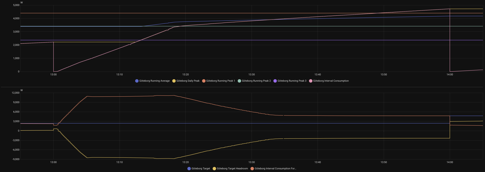

**Top panel:** At 13:00 the Interval Consumption (pink) begins climbing steeply, reaching around 4,500 W by the end of the hour. The Daily Peak (yellow) rises in lock-step once consumption exceeds the previous daily peak. Period Peak 2 and 3 (purple and teal) stay flat — the new hour is tracking to beat Period Peak 1 (orange, ~4,800 W) but is not quite there yet. The Period Average (blue) begins rising as soon as the daily peak qualifies to enter the monthly list, climbing from around 3,200 W toward 3,900 W across the hour.

**Bottom panel:** Target Headroom (yellow) goes strongly negative almost immediately — reaching around −8,000 W at the worst point just after 13:05. This is because the Interval Consumption Forecast (orange) extrapolates the initial high rate over the full hour and produces a very large projected peak. As the hour progresses and the actual consumption rate becomes clearer, the forecast settles and headroom gradually recovers toward zero. At 14:00 the interval resets, the peak commits, and the sensors snap to their new steady-state values.

### Peak cost

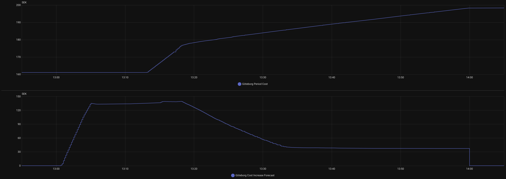

These are the cost sensors for the same 13:00–14:00 window.

**Top panel (Period Cost):** Flat at around 160 SEK until approximately 13:12, when the daily peak grows enough to displace a slot in the monthly average. From that point the Period Cost climbs steadily, reaching almost 200 SEK by 14:00. This is the real monetary cost of the load event — an increase of about 40 SEK per month from a single hour.

**Bottom panel (Cost Increase Forecast):** This sensor shows in real time how much the monthly bill would increase *if the current interval ends as a new peak*. It spikes to around 130 SEK within the first ten minutes of the hour, then gradually falls as the projected end-of-hour consumption settles to a lower value. At 14:00 it drops to zero as the hour closes and the cost impact moves permanently into Period Cost.

**Reading these two sensors together:** Cost Increase Forecast is the early warning — it tells you what you are *about to pay* if you do nothing. Period Cost is the running total — it tells you what you have *already locked in*. During a peak-forming event, watch Cost Increase Forecast to understand the cost of inaction, and Period Cost to track what is already committed.

### Automation suggestion

Use Cost Increase Forecast as a cost-aware load-shedding trigger. This is more directly useful than pure power thresholds because it accounts for where the current peak sits relative to the existing monthly peaks:

```yaml
automation:
  - alias: "Shed load if cost increase forecast exceeds threshold"
    trigger:
      - platform: numeric_state
        entity_id: sensor.peak_monitor_cost_increase_forecast
        above: 20   # SEK — adjust to your tolerance
    condition:
      - condition: state
        entity_id: sensor.peak_monitor_status
        state: "active"
    action:
      - service: switch.turn_off
        target:
          entity_id: switch.ev_charger
      - service: notify.mobile_app
        data:
          message: >
            Peak Monitor: projected cost increase is
            {{ states('sensor.peak_monitor_cost_increase_forecast') }} SEK.
            EV charging paused.
```

You can combine both sensors for a two-stage response — pause at a modest threshold, alert at a higher one:

```yaml
automation:
  - alias: "Alert on very high cost increase forecast"
    trigger:
      - platform: numeric_state
        entity_id: sensor.peak_monitor_cost_increase_forecast
        above: 80
    condition:
      - condition: state
        entity_id: sensor.peak_monitor_status
        state: "active"
    action:
      - service: notify.mobile_app
        data:
          message: >
            ⚠️ Peak Monitor: projected monthly cost increase is
            {{ states('sensor.peak_monitor_cost_increase_forecast') }} SEK.
            Consider reducing consumption immediately.
```

---

## Dashboard card examples

These are real Home Assistant entity cards from a live installation, showing what the sensors look like in a typical dashboard layout.

### Individual sensor cards

The most common way to monitor your tariff at a glance is a simple entity card for each key sensor.

**Period Average** — your current monthly tariff level. This is the number that determines your capacity fee.

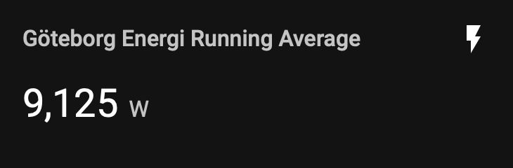

**Target** — the consumption ceiling for the current interval. Stay below this to avoid increasing your tariff.

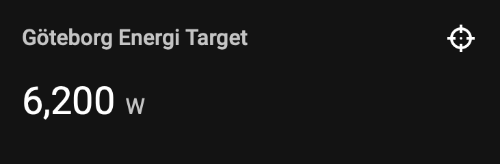

**Target Headroom** — how much room remains between the current forecast and the target. Positive means you have headroom to spare; negative means you are projected to exceed target this interval.

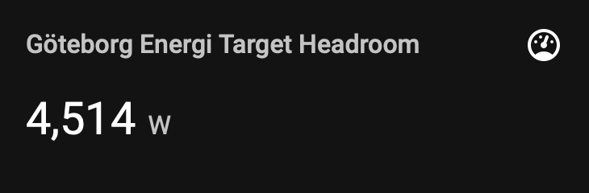

**Status** — whether the tariff is currently active, reduced, or inactive.

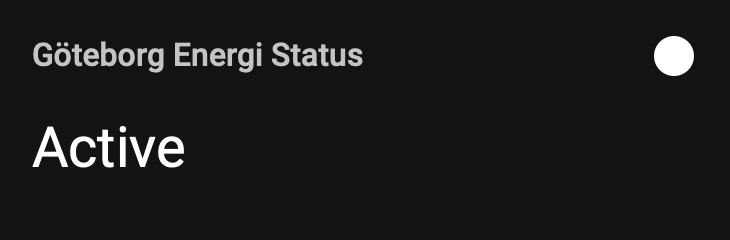

**Period Cost** — estimated monthly capacity fee in your configured currency.

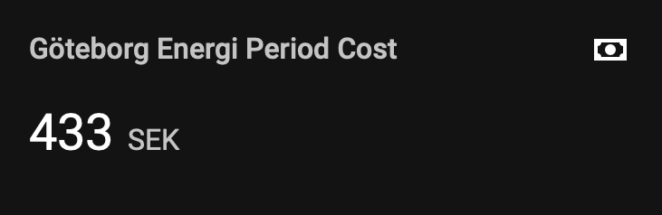

---

### Gauge card — Estimation Percentage of Target

The Estimation Percentage of Target sensor is well suited to a gauge card. At 27% here, consumption is well within the safe zone. Colour thresholds (green/amber/red) give an immediate visual signal without needing to read a number.

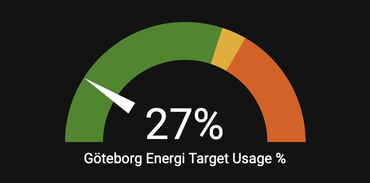

```yaml
type: gauge
entity: sensor.peak_monitor_target_usage_percentage
min: 0
max: 150
severity:
  green: 0
  yellow: 90
  red: 100
```

---

### Combined cards

**Current status dashboard** — a single entities card covering the four most useful real-time sensors: status, percentage, headroom, and target. This gives a complete picture of the current situation at a glance.

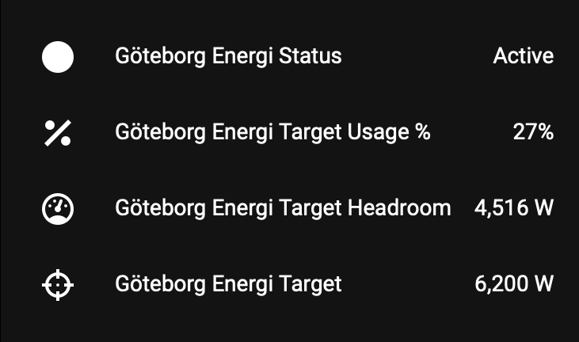

```yaml
type: entities
entities:
  - entity: sensor.peak_monitor_status
  - entity: sensor.peak_monitor_target_usage_percentage
  - entity: sensor.peak_monitor_target_headroom
  - entity: sensor.peak_monitor_target
```

**Monthly cost summary** — combines period average, period cost, and daily peak in one card.

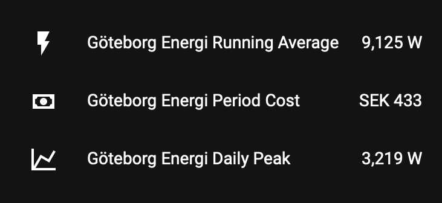

```yaml
type: entities
entities:
  - entity: sensor.peak_monitor_period_average
  - entity: sensor.peak_monitor_period_cost
  - entity: sensor.peak_monitor_daily_peak
```

---

### History graph — Period Average over a week

The mini history graph card on the Period Average sensor shows how the monthly tariff has stepped up over the past week as new peaks were committed each day. Each step up represents a new daily peak displacing a lower value in the monthly average.

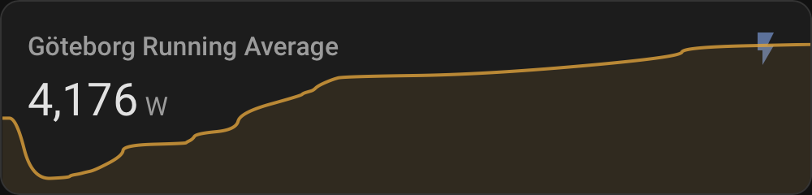

```yaml
type: history-graph
entities:
  - entity: sensor.peak_monitor_period_average
hours_to_show: 168
```
