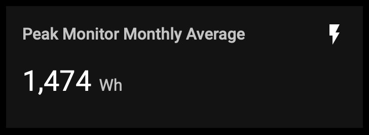
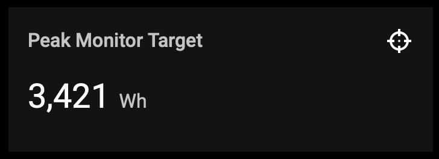
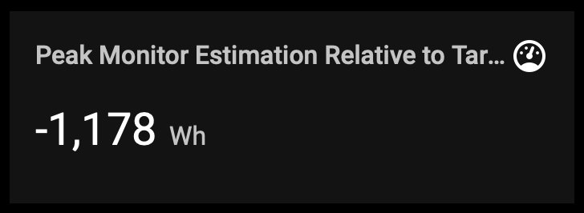
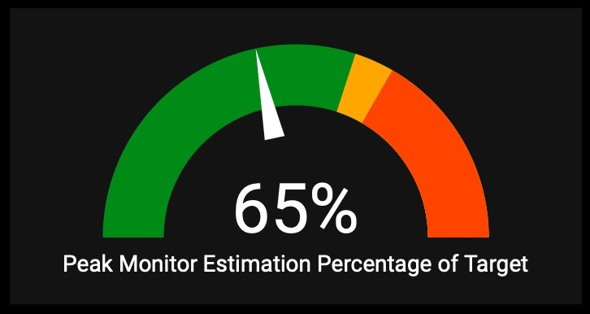
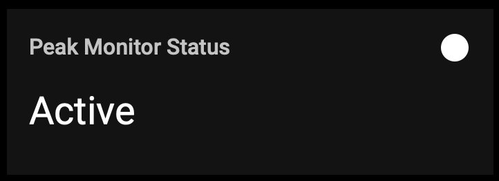
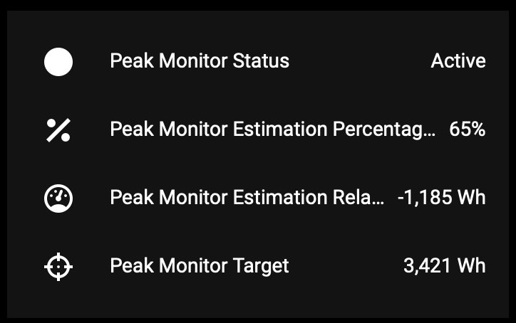
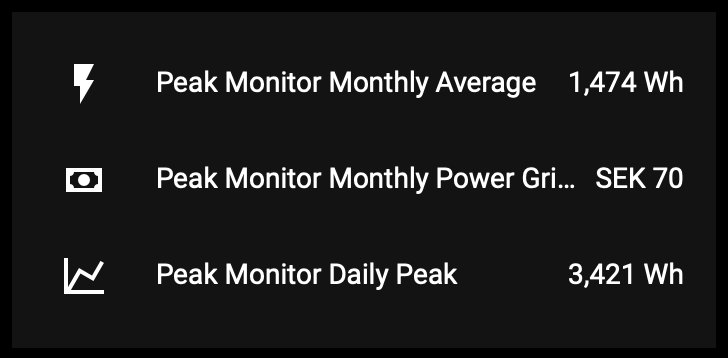
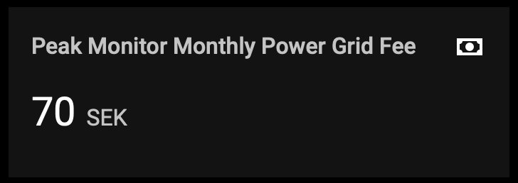
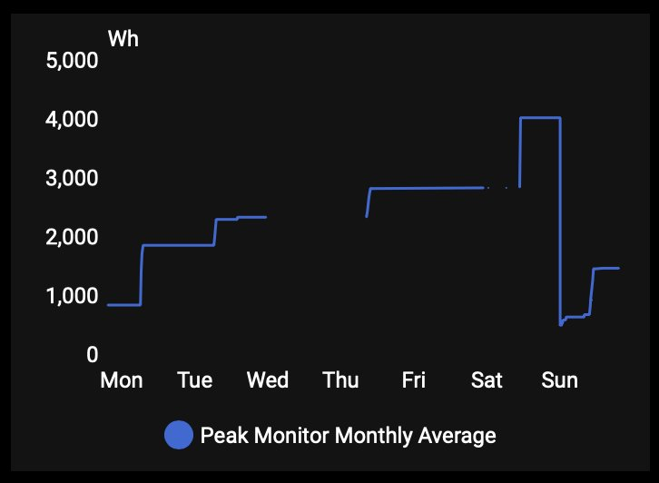

# Sensor Reference

This document describes all sensors created by the Peak Monitor integration, what they represent, their units, and when they appear.

## Table of Contents
- [Core Sensors (Always Visible)](#core-sensors-always-visible)
- [Optional Sensors](#optional-sensors)
- [Understanding the Sensors](#understanding-the-sensors)

---

## Core Sensors (Always Visible)

These sensors are created for every Peak Monitor installation.

### Running Average
**Entity ID:** `sensor.{name}_running_average`  
**Unit:** W (Watt)  
**State Class:** Total Increasing (resets at month boundary = new cycle)  
**Device Class:** Energy  
**Description:** The current power tariff calculated as the average of your top N running peaks.

**What it shows:**
This is your current tariff level - the average power consumption of your highest peak hours this month.

**How it's calculated:**
1. Tracks your top N interval consumptions (where N = "Number of peaks to track")
2. Calculates the average of these peaks
3. This average is your tariff base

**Example:**
```
Configuration: Track top 3 peaks
Current month peaks: 5200, 4800, 4500, 3200, 2800 Wh

Running Average = (5200 + 4800 + 4500) / 3 = 4833 Wh
```

**Attributes:**
- `price`: Cost in SEK (if price per kW configured)
- `price_unit`: "SEK"
- `includes_today`: Whether today's peak is included in the average
- `last_updated`: Timestamp of the last time the running peaks changed
- `running_peak_1`, `running_peak_2`, etc.: Individual peak values (sorted by descending value, today's daily peak included when applicable)
- `running_peak_1_is_today`, `running_peak_2_is_today`, etc.: `true` if that peak position belongs to today's daily peak

**Why it matters:**
This number determines your monthly power grid fee. Lower is better!

  
*Entity card showing the current monthly average*

---

### Target
**Entity ID:** `sensor.{name}_target`  
**Unit:** W (Watt)  
**State Class:** Measurement  
**Description:** The threshold consumption for the current hour. Stay below this to avoid increasing your tariff.

**What it shows:**
The maximum interval consumption you should aim for in the current hour to avoid creating a new monthly peak.

**How it works:**
- If interval consumption estimate stays below this target, your monthly tariff won't increase
- If you exceed this target, your consumption becomes a new monthly peak
- Updates every hour if there is a new hourly peak affecting your bill

**Example:**
```
Monthly peaks: [5200, 4800, 4500]
Current Target: 4500 Wh

If interval consumption estimate:
- Stays at 4300 Wh → Good! No change to tariff
- Reaches 4600 Wh → New peak! Replaces 4500 in the list
```

**Attributes:**
- `last_updated`: Timestamp of the last time the target value changed

  
*Entity card showing the current target threshold*

---

### Estimation Relative to Target
**Entity ID:** `sensor.{name}_relative`  
**Unit:** W (Watt)  
**State Class:** Measurement  
**Description:** How far above or below the target you currently are.

**What it shows:**
- **Negative value:** You're below target (good!)
- **Zero:** You're exactly at target
- **Positive value:** You're above target (creating a new peak)

**How it's calculated:**
```
Relative = Interval Consumption Estimate - Target
```

**Example:**
```
Target: 4500 Wh
Estimated interval consumption: 4200 Wh
Relative = 4200 - 4500 = -300 Wh (300 Wh below target ✓)

Target: 4500 Wh
Estimated interval consumption: 4800 Wh
Relative = 4800 - 4500 = +300 Wh (300 Wh above target ✗)
```

**Why it matters:**
Quick visual indicator of your current status. Negative = safe, Positive = danger!

  
*Entity card showing estimation relative to target — negative means safely below, positive means exceeding*

---

### Estimation Percentage of Target
**Entity ID:** `sensor.{name}_percentage`  
**Unit:** % (Percent)  
**State Class:** Measurement  
**Description:** Estimation as a percentage of the target.

**What it shows:**
How close the estimation is to the target as a percentage.

**How it's calculated:**
```
Percentage = (Estimated Consumption / Target) × 100
```

**Example:**
```
Target: 4500 Wh
Estimated: 4200 Wh
Percentage = (4200 / 4500) × 100 = 93%

Target: 4500 Wh
Estimated: 4800 Wh
Percentage = (4800 / 4500) × 100 = 107%
```

**Why it matters:**
Easy to understand visual indicator. Aim to stay under 100%!

  
*Gauge card showing estimation as a percentage of target (green <90%, amber 90–100%, red >100%)*


---

### Status
**Entity ID:** `sensor.{name}_status`  
**Unit:** None (Text state)  
**Device Class:** Enum  
**Possible values:** `inactive`, `reduced`, `active`  
**Description:** Current state of the tariff system.

**States:**
- **inactive:** Tariff is currently off (outside active hours/months, holiday, weekend with "no tariff")
- **reduced:** Tariff is active but at reduced rate (reduced hours, weekend/holiday with "reduced tariff")
- **active:** Tariff is fully active and tracking consumption

**Attributes:**
- `inactive_reason`: Why tariff is inactive (only when state = inactive)
- `reduced_reason`: Why tariff is reduced (only when state = reduced)

**Possible reasons:**
- `"external_mute"` – overridden by external mute sensor
- `"excluded_month"` – current month is not in active months
- `"holiday"` – today is a holiday or holiday evening
- `"weekend"` – today is a weekend day
- `"time_of_day"` – outside the configured active/reduced hours

**Example:**
```
Saturday at 14:00, Weekend behavior = "No tariff"
State: inactive
Attribute: inactive_reason = "weekend"

Tuesday at 23:00, Reduced hours 22-6
State: reduced
Attribute: reduced_reason = "time_of_day"

Tuesday at 14:00, Normal tariff hours
State: active
(No reason attributes)
```

**Why it matters:**
Helps you understand when your consumption is being monitored. Use for automations!

  
*Entity card showing the current tariff status (Active / Reduced / Inactive)*

---

## Optional Sensors

These sensors only appear based on your configuration.

### Daily Peak
**Entity ID:** `sensor.{name}_daily_peak`  
**Unit:** W (Watt)  
**State Class:** Total Increasing (resets at midnight = new cycle)  
**Device Class:** Energy  
**When shown:** Only when "Only one peak per day" is enabled  
**Description:** The highest interval consumption so far today.

**What it shows:**
The maximum single-interval consumption you've had today during active tariff hours.

**How it works:**
- Resets to the configured reset value at midnight
- Updates throughout the day as new interval consumption is recorded
- This value is committed to running peaks at midnight

**Example:**
```
Today's interval consumptions during tariff hours:
08:00 → 3200 Wh
12:00 → 4500 Wh (becomes daily peak)
15:00 → 3800 Wh
18:00 → 4200 Wh

Daily Peak = 4500 Wh
```

**Why it matters:**
Shows your best/worst hour today. This may become one of your running peaks at midnight.

**Attributes:**
- `last_updated`: Timestamp of the last time the daily peak value increased (not when it was recalculated)

---

### Power Grid Peak Tariff
**Entity ID:** `sensor.{name}_power_grid_peak_tariff`  
**Unit:** SEK (Swedish Krona)  
**State Class:** Total  
**Device Class:** Monetary  
**When shown:** Only when "Price per kW" is configured (> 0)  
**Description:** Estimated total monthly power grid fee.

**What it shows:**
Your estimated monthly cost for power grid fees based on current tariff and fixed fee.

**How it's calculated:**
```
Fee = Fixed Monthly Fee + (Price per kW × Monthly Average / 1000)
```

**Example:**
```
Running Average: 4833 Wh = 4.833 kW
Price per kW: 47.5 SEK
Fixed Fee: 522 SEK

Fee = 522 + (47.5 × 4.833) = 522 + 229.57 = 751.57 SEK
```

**Why it matters:**
See your estimated grid fee cost in real money terms!

*View: Energy dashboard cost section or entity card with currency*

---

### Cost Increase Estimate
**Entity ID:** `sensor.{name}_estimated_cost_increase_estimate`  
**Unit:** SEK (Swedish Krona)  
**State Class:** Measurement  
**State Class:** Measurement  
**Device Class:** None (real-time delta, can be zero or vary freely)  
**Description:** Real-time estimate of how much your monthly bill would increase if current hour becomes a new peak.

**What it shows:**
If you're currently above target, this shows how much extra you'll pay monthly if this hour ends as a peak.

**How it's calculated:**
Only shows a value when current estimated consumption > target.

```
If above target:
  New Average = average including current hour as new peak
  Old Average = current monthly average
  Cost Increase = (New Average - Old Average) / 1000 × Price per kW
```

**Example:**
```
Current peaks: [5200, 4800, 4500]
Current average: 4833 Wh
Estimated interval consumption: 5500 Wh (new peak!)

New peaks would be: [5500, 5200, 4800]
New average: 5167 Wh

Cost Increase = (5167 - 4833) / 1000 × 47.5 = 0.334 × 47.5 = 15.87 SEK
```

**Why it matters:**
See in real-time how much that electric car charging or oven use will cost you monthly!

*View: Lovelace entity card during a high-consumption event showing cost impact*

---

### Internal Estimation
**Entity ID:** `sensor.{name}_interval_consumption_estimate`  
**Unit:** W (Watt)  
**State Class:** Measurement  
**When shown:** Only when NO external estimation sensor is configured  
**Description:** Built-in linear estimation of total interval consumption.

**What it shows:**
Estimated total consumption for the current hour based on current rate.

**How it's calculated:**
```
Minutes elapsed in hour: M
Current consumption: C
Estimated total = C × (60 / M)
```

**Example:**
```
Current time: 14:23 (23 minutes into hour)
Consumption so far: 1800 Wh

Estimated total = 1800 × (60 / 23) = 1800 × 2.6 = 4696 Wh
```

**Why it matters:**
Gives you a real-time projection of where you're headed. Used for all the target/relative calculations.

---

### Interval Consumption
**Entity ID:** `sensor.{name}_interval_consumption`  
**Unit:** W (Watt)  
**State Class:** Total Increasing (resets every hour = new cycle)  
**Device Class:** Energy  
**When shown:** Only when "Sensor resets every hour" is DISABLED (cumulative sensor mode)
**Description:** Calculated interval consumption from a cumulative sensor.

**What it shows:**
The energy consumed during the current hour, calculated from a cumulative sensor.

**How it's calculated:**
```
Hourly = Current Cumulative Value - Value at Hour Start
```

**Example:**
```
12:00 - Cumulative: 45200 Wh (hour starts)
12:30 - Cumulative: 45520 Wh
Interval Consumption = 45520 - 45200 = 320 Wh (so far this hour)
```

**Why it matters:**
Converts your cumulative meter into hourly values that the integration can use.

---

### Running Peak 1, 2, 3, etc.
**Entity ID:** `sensor.{name}_running_peak_1`, `sensor.{name}_running_peak_2`, etc.  
**Unit:** W (Watt)  
**State Class:** Total Increasing (resets at month boundary = new cycle)  
**Device Class:** Energy  
**When shown:** Always created (one for each peak tracked), but disabled. User must enable them manually 
**Default:** Hidden in entity registry  
**Description:** Individual monthly peak values.

**What they show:**
Each sensor shows one of your monthly peak consumption hours.

**Example:**
```
Tracking 3 peaks:
running_peak_1: 5200 Wh (highest)
running_peak_2: 4800 Wh (second)
running_peak_3: 4500 Wh (third)

Average = (5200 + 4800 + 4500) / 3 = 4833 Wh
```

**Why they're hidden:**
The Running Average sensor shows the important number (the average). These individual peaks are available as attributes on that sensor, so separate sensors are usually not needed.

**Attributes:**
- `last_updated`: Timestamp of the last time the running peaks list changed

**When to enable:**
- If you want to track individual peaks in graphs
- If you want separate automations for each peak
- To see which specific hours were your peaks

---

## Understanding the Sensors

### The Flow of Information

```
┌─────────────────────────┐
│   Consumption Sensor    │  (Your energy meter)
│   sensor.power_meter    │
└──────────┬──────────────┘
           │
           ↓
┌─────────────────────────┐
│  Interval Consumption     │  (Calculated if cumulative)
│  Internal tracking      │
└──────────┬──────────────┘
           │
           ↓
┌─────────────────────────┐
│  Internal Estimation    │  (Projects end-of-hour)
│  OR External Sensor     │
└──────────┬──────────────┘
           │
           ↓
┌─────────────────────────┐
│     Daily Peak          │  (Max hour today)
│   Updated hourly        │
└──────────┬──────────────┘
           │ (At midnight)
           ↓
┌─────────────────────────┐
│   Running Peaks         │  (Top N hours)
│   running_peak_1..N     │
└──────────┬──────────────┘
           │
           ↓
┌─────────────────────────┐
│   Monthly Average       │  (Your tariff)
│   Used for all costs    │
└─────────────────────────┘
```

### Real-Time Monitoring Sensors

These update continuously during the hour:
- **Internal Estimation** / External estimation sensor
- **Target**
- **Estimation Relative to Target**
- **Estimation Percentage of Target**
- **Cost Increase Estimate**

### Daily Update Sensors

These update at midnight:
- **Daily Peak** (resets)
- **Running Peaks** (one new peak added)
- **Running Average** (recalculated)

### Status Sensor

Updates based on time, calendar, and configuration:
- Changes state based on hour, day, month, holidays
- Updates attributes when state changes

---

## Visualization Examples

### Recommended Lovelace Cards

#### Current Status Dashboard
```yaml
type: entities
entities:
  - entity: sensor.peak_monitor_status
  - entity: sensor.peak_monitor_percentage
  - entity: sensor.peak_monitor_relative
  - entity: sensor.peak_monitor_target
```



#### Power Gauge
```yaml
type: gauge
entity: sensor.peak_monitor_percentage
min: 0
max: 150
severity:
  green: 0
  yellow: 90
  red: 100
```


#### Monthly Cost Card
```yaml
type: entities
entities:
  - entity: sensor.peak_monitor_running_average
  - entity: sensor.peak_monitor_monthly_power_grid_fee
  - entity: sensor.peak_monitor_daily_peak
```



#### Power Grid Peak Tariff Card
```yaml
type: entity
entity: sensor.peak_monitor_monthly_power_grid_fee
```

  
*Entity card showing the current estimated monthly power grid fee in SEK*

#### History Graph
```yaml
type: history-graph
entities:
  - entity: sensor.peak_monitor_running_average
hours_to_show: 168
```

  
*History graph showing the monthly average stepping up each time a new peak is committed during the week*

---

## Using Sensors in Automations

### Example: Alert When Approaching Limit

```yaml
automation:
  - alias: "Peak Monitor Warning"
    trigger:
      - platform: numeric_state
        entity_id: sensor.peak_monitor_percentage
        above: 90
    condition:
      - condition: state
        entity_id: sensor.peak_monitor_status
        state: "active"
    action:
      - service: notify.mobile_app
        data:
          message: "Power consumption at {{ states('sensor.peak_monitor_percentage') }}% of target!"
```

### Example: Stop Charging When Above Target

```yaml
automation:
  - alias: "Stop EV Charging Above Target"
    trigger:
      - platform: numeric_state
        entity_id: sensor.peak_monitor_relative
        above: 0
    condition:
      - condition: state
        entity_id: switch.ev_charger
        state: "on"
    action:
      - service: switch.turn_off
        target:
          entity_id: switch.ev_charger
      - service: notify.mobile_app
        data:
          message: "EV charging stopped - above tariff target"
```

### Example: Monthly Cost Report

```yaml
automation:
  - alias: "Monthly Tariff Report"
    trigger:
      - platform: time
        at: "06:00:00"
    condition:
      - condition: template
        value_template: "{{ now().day == 1 }}"
    action:
      - service: notify.email
        data:
          title: "Monthly Peak Monitor Report"
          message: >
            Running Average: {{ states('sensor.peak_monitor_running_average') }} Wh
            Grid Fee: {{ states('sensor.peak_monitor_monthly_power_grid_fee') }} SEK
            Peak 1: {{ state_attr('sensor.peak_monitor_running_average', 'running_peak_1') }} Wh
```

---

## Sensor States Explained

### When Sensors Show "Unknown" or "Unavailable"

**"Unknown":**
- Integration just started and doesn't have data yet
- Usually resolves within one hour
- Normal during first setup

**"Unavailable":**
- Consumption sensor is unavailable/not found
- Check that your consumption sensor is working
- Check entity ID is correct in configuration

### When Values Are Zero

**Target = 0:**
- Tariff is currently inactive (check Status sensor)
- Outside active hours or months
- Holiday or weekend with "no tariff"

**Estimation Percentage = 0:**
- No consumption data yet this hour
- Consumption sensor hasn't updated
- Normal at the start of each hour

### When Values Seem Wrong

**Very high Running Average:**
- Check if a one-time event (oven, sauna, charging) created a peak
- Peaks persist for the entire month
- Will reset at the start of next month

**Estimation seems off:**
- Built-in estimation is linear (assumes constant rate)
- Use external estimation sensor for better accuracy
- Early in the hour, estimates can be very sensitive to small consumption

---

## Technical Details

### Update Frequency

| Sensor | Update Frequency |
|--------|------------------|
| Estimation | Every time consumption sensor updates |
| Target | Every time consumption sensor updates |
| Relative | Every time consumption sensor updates |
| Percentage | Every time consumption sensor updates |
| Status | On state change (hour, day, holiday) |
| Daily Peak | On consumption increase during active hours |
| Running Peaks | At midnight (monthly on 1st) |
| Monthly Average | When running peaks change |
| Cost sensors | When monthly average changes |

### Data Persistence

The integration stores these values between Home Assistant restarts:
- Monthly peaks
- Daily peak
- Last update timestamps
- Cumulative consumption tracking

Data is stored in: `.storage/peak_monitor_data_{entry_id}`

### State Class Explained

- **Measurement:** Can go up or down, represents a current level or computed value.
  - Used for: Target, Relative to Target, Percentage, and Cost Increase Estimate.
  - These are threshold/prediction/delta values that move freely, so `total_increasing` would be incorrect.
  - `device_class` is omitted where HA's device class rules would require `total/total_increasing` but the value can decrease. Units are preserved.

- **Total Increasing:** Only increases within a cycle; a drop signals the start of a new cycle (HA handles this automatically).
  - Used for: **Running Average**, **Running Peak N**, **Daily Peak**, **Interval Consumption**.
  - *Monthly Average & Running Peak N:* a new peak only enters when it exceeds the current minimum, so each slot and the average are strictly non-decreasing. Monthly reset is a new cycle.
  - **Power Grid Peak Tariff** uses `total` (the only state class `monetary` device class allows); it non-decreasingly tracks the monthly average within the month.
  - *Daily Peak:* only increases within the day; midnight reset is a new cycle.
  - *Interval Consumption:* only increases within the hour; hour-boundary reset is a new cycle.
